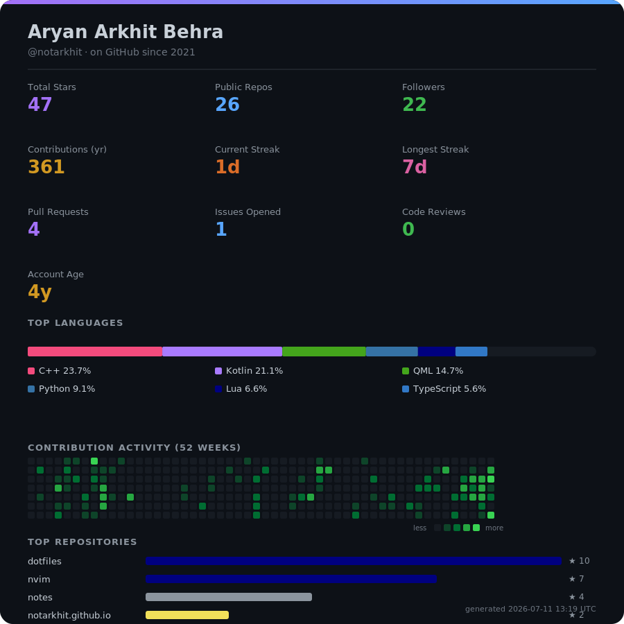

### Top Repos

- **dotfiles** — ★ 10 · Lua
- **nvim** — ★ 7 · Lua
- **notes** — ★ 4 · —
- **notarkhit.github.io** — ★ 2 · JavaScript
- **django-password-vault** — ★ 2 · HTML

Card auto-generated by <code>scripts/generate.mjs</code> via GitHub Actions — see <code>.github/workflows/metrics.yml</code>

